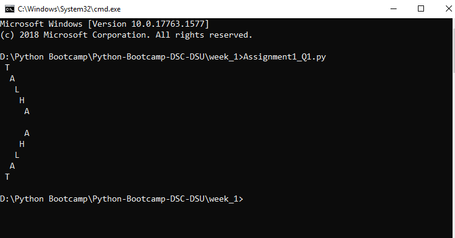
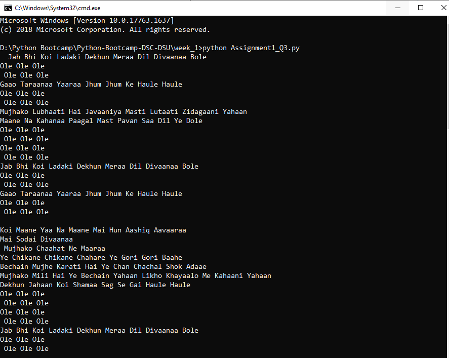

# DSC-DSU | Python Bootcamp 2020 | Week 1

Paste questions and brief writeup here
<h1>
Question # 1
</h1>

Here We use For loop to print Forward and Reverse Diagnol

 

<h1>
Question # 2
</h1>

 Create a program to take as input 5 student records And then output the records in a tabular form with class average, class highest and class lowest at end in the following format.
Use dictionaries (list of dictionaries in exact)
Insert atleast 5 records
Input must be user-given
(Optional) validate the user input, i.e marks aren't greater 100 and other such validations you think there might be

 

<h1>
Question # 3
</h1>

Here we print lyrics of the song using time library and split() method

 
